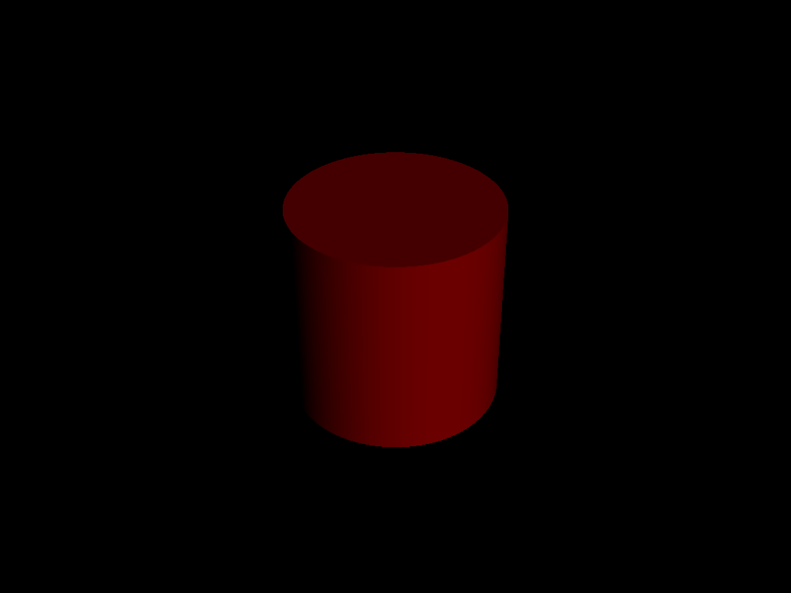
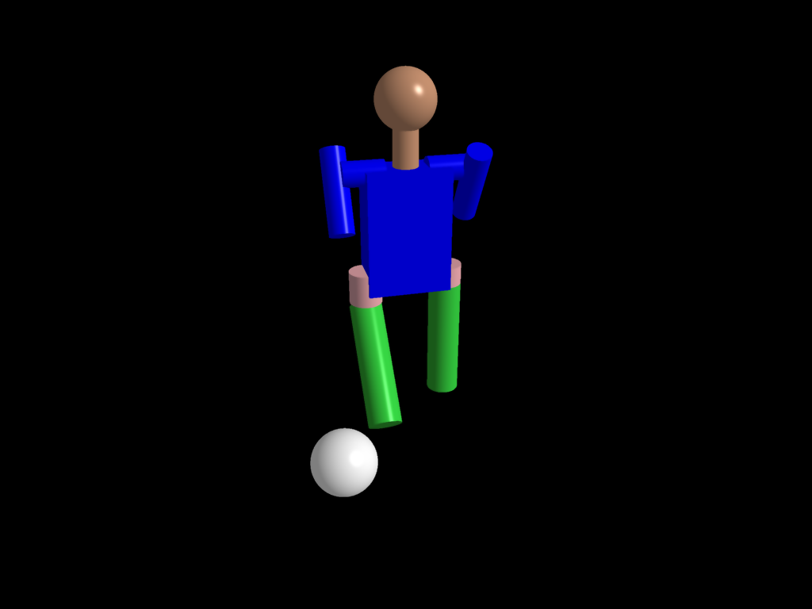

## Project 3: Intersect

Please fill this out for Intersect only. The project handout can be found [here](https://cs1230.graphics/projects/ray/1).

### Output Comparison
Run the program with the specified `.ini` file to compare your output (it should automatically save to the correct path).
> If your program can't find certain files or you aren't seeing your output images appear, make sure to:<br/>
> 1. Set your working directory to the project directory
> 2. Set the command-line argument in Qt Creator to `template_inis/intersect/<ini_file_name>.ini`
> 3. Clone the `scenefiles` submodule. If you forgot to do this when initially cloning this repository, run `git submodule update --init --recursive` in the project directory

> Note: once all images are filled in, the images will be the same size in the expected and student outputs.

| File/Method To Produce Output | Expected Output | Your Output |
| :---------------------------------------: | :--------------------------------------------------: | :-------------------------------------------------: |
| unit_cone.ini |   |  |
| unit_cone_cap.ini |  |  |
| unit_cube.ini |  |  |
| unit_cylinder.ini |  |  |
| unit_sphere.ini |  |  |
| parse_matrix.ini |  |  |
| ambient_total.ini |  |  |
| diffuse_total.ini |  |  |
| specular_total.ini |  |  |
| phong_total.ini |  |  |
| directional_light_1.ini |  |  |
| directional_light_2.ini |  |  |

### Design Choices

#### Functionality

- **Scene Parser** is integrated and can correctly parse the scene tree data to generate render data with calculated CTMs.
- **Camera** is implemented in ```src/camera/```, which stores camera related parameters (e.g., position, width/height, aspect ratio, view matrix, and etc.). The view matrix calculation is performed when a camera instance is created.
- **Phong Illumination** is implemented as ```calculateLighting``` function in ```src/raytracer/raytracer.cpp/```, which calculates illumination info for directional lighting.
- **Shape Implementations** can be found in ```src/primitive/primitivefunction.cpp/```, where intersections (both intersection point and normal info) with 4 primitive shapes (cube, cylinder, sphere, and cone) are calculated.
- **Intersection pipeline** is implemented as ```calculateIntersection``` function in ```src/raytracer/raytracer.cpp```, which calculates intersection for a ray with shapes. It stores the nearest intersection and returns both the intersection point and normal info.

#### Software Engineering, Efficiency, Stability

- Code is arranged in folders and classes based on the functionalities. Functions are properly designed to focus on single functionality for better adaptibility.
- Detailed comments and annotations are included, especially for explaining the algorithms in functions.
- Both parallerization and acceleration data structures are used to enable efficient rendering. Code structures are revised to reduce reduncdant calculation.
- Code has been tested on multiple scene files (including mesh) and all of them render correctly when compared to TA solutions.

### Collaboration/References

I clarify that there is no collaboration include when I do this project.

References for mathematical formulas only (no code are referenced):
- Ray-triangle intersection: https://en.wikipedia.org/wiki/M%C3%B6ller%E2%80%93Trumbore_intersection_algorithm

References for code doc (no complete code are referenced):
- Qt based parallel: https://doc.qt.io/qt-6/qthread.html

References for helper functions from labs and previous projects:
- project raster: code for filters (bilateral filter and mean filter).
- lab05: code for recursively parse the scene file and setup render data.
- lab06: code for Phong illumination.

### Known Bugs

Currently there are no obvious bugs related to functionality.

### Extra Credit

#### Acceleration data structure

Implemented BVH acceleration. BVH implementation can be found in ```src/acceleration/```, where ```BVH``` class contains build and traverse functions and ```BVHNode``` and ```AABB``` are helper classes that construct BVH.

The overall algorithn of this BVH implementation follows the top-down implementation, which it first create bounding box that contains all shapes and then recursively divide the space to create smaller bounding boxes. When dividing the space (for a parent box), it divides along the longest axis of the box to enable more balanced and efficient spacial division arrangement.

#### Parallelization

Implemented Qt-based parallelization, which divides the render image plane into blocks and parallely render the blocks for speedup. The block sizes are dynamically determined by ```QThread::idealThreadCount()``` as the number of cores to maximize the parallelization capability. Access to shared data are protected by mutex lock to prevent racing conditions and ```QtFutureWatcher``` is used to monitor the concurrent computing process.

#### Anti-aliasing

Implemented Bilaterial filter as a post-processing anti-aliasing technique. The code for filter can be found in ```src/antialias/```.

The reason for choosing bilateral filter is that it preserves details while smoothing the image. I also included other smoothing filters including median filter to satisfy specific post-processing needs.

#### Super-sampling

Implemented adaptive super-sampling by first calculating the variance of intensity around a pixel on image plane and then super-sample (shooting rays at corners of this pixel and average) on this pixel if the variance is large.

The variance of a pixel (the ray shot from it) is calculated by the sum of differences of neigbbor pixel intensities with the average intensity. If the variance exceeds a threshold and then super-sampling is conducted by shooting rays from 4 corners and the center of a pixel and then averaged to get the final color of the pixel.

#### Create your own scene file

Created a scene file ```football_player.json``` which contains a football player and a ball. The head, neck, shoulder, arms, body, hips, and legs of the players are represented by different geometries.

| File/Method To Produce Output | Expected Output | Your Output |
| :---------------------------------------: | :--------------------------------------------------: | :-------------------------------------------------: |
| football_player.ini |   |  |

#### Render mesh

Mesh rendering is implemented by creating a BVH (mesh specific version in ```src/acceleration/BVH.cpp```) for each mesh (helper functions in ```src/primitive/mesh.cpp```) when initialzing the shape list in render data, and traverse the mesh BVH when calculating the intersection with a mesh primitive. The intersection is calculated by ray-triangle intersection in ```src/primitive/primitivefunction.cpp```.

The mesh loading is implemented as loading in cache (```src/primitive/meshcache.cpp```) which reduce multiple file reading and can access mesh data directly from the cach. The design for creating a mesh-specific BVH for each mesh primitive instead of creating primitives for each triangle is to reduce the redundant specification of materal info associated with each primitive.

| File/Method To Produce Output | Expected Output | Your Output |
| :---------------------------------------: | :--------------------------------------------------: | :-------------------------------------------------: |
| bunny_mesh.ini |   |  |
| mesh.ini |   |  |
